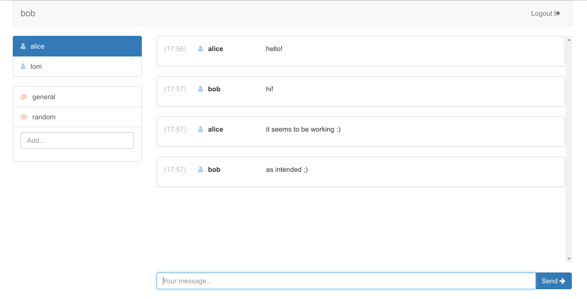

# Chat

This is a multi-user chat webapp for 'Organization and Development of Open Source Projects' course on university. It was definitely the best project I've ever wrote to pass a course. It consists of backend, frontend and two bots, supported by Docker.

Cool stuff used:

* backend: Grails 3, Spring Security, H2
* frontend: React, Redux, react-bootstrap
* calculator bot: Node.js
* answer bot: C# on .NET Core

